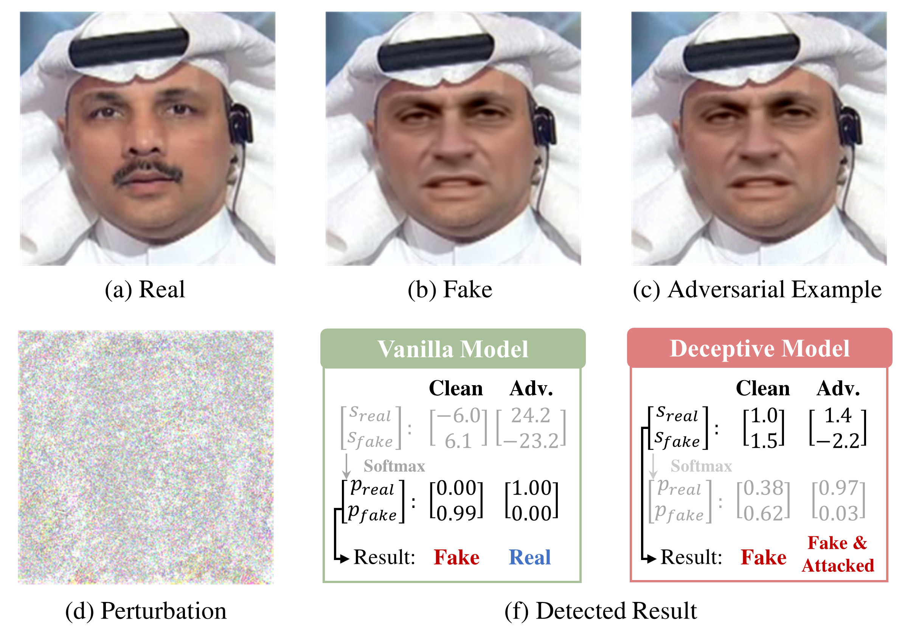

# Jointly Defending DeepFake Manipulation and Adversarial Attack using Decoy Mechanism

## Overview 

<p align="center">
  
</p>

This is the official pytorch implementation of the [paper](https://ieeexplore.ieee.org/abstract/document/10061274), G.L. Chen and C.C. Hsu, "Jointly Defending DeepFake Manipulation and Adversarial Attack using Decoy Mechanism", IEEE T-PAMI 2023. In this research, we proposed a novel decoy mechanism based on statistical hypothesis testing against DeepFake manipulation and adversarial attacks. The proposed decoy mechanism successfully defended the common adversarial attacks and indirectly improved the power of hypothesis test to achieve 100% detection accuracy for both white-box and black-box attacks. We demonstrated that the decoy effect can be generalized to compressed and unseen manipulation methods for both DeepFake and attack detection.

---
## Dataset
We use the offcial setting to split FF++ into train, val, and test. For DFDC and CelebDF, we randomly sample 100 real and 100 fake videos for evaluation. All the face images are cropped using [BlazeFace](https://github.com/hollance/BlazeFace-PyTorch). Please download datasets ([FF++](https://www.dropbox.com/s/mlct4ul9cz4xe97/FF%2B%2B.zip?dl=0) (10% test set), [DFDC](https://www.dropbox.com/s/ofwfaid497fxg70/DFDC.zip?dl=0), [CelebDF](https://www.dropbox.com/s/uri5qirgdxv6fkt/CelebDF.zip?dl=0)) and organize as follow:

    │decoy
    ├──data
    │   ├──CelebDF
    │   ├──DFDC
    │   ├──FF++
    ├──...


---
## Pretrained Model
All the models were trained on FF++ raw training set. Please download the [model weights](https://www.dropbox.com/s/56vo4e12jliquhd/weight.zip?dl=0) and organize as follow:

    │decoy
    ├──weight
    │   ├──Meso.pt
    │   ├──MesoDeception.pt
    │   ├──Xception.pt
    │   ├──XDeception.pt
    ├──...

---
## Prerequisites

The code is tested on Ubuntu 20.04, Geforce RTX 3090 * 2, and cuda 10.2.
- python 3.7
- pytorch 1.10.2
- torchvision 0.11.3

<br/>


---
## Training

Train the vanilla model:
```bash
CUDA_VISIBLE_DEVICES=-1 python3 -B train.py --model_name Xception --train_video_batch 10 --train_img_batch 8 --save_path ./weight/Xception.pt --log_path ./log/Xception.log
```
Train the deceptive model:
```bash
CUDA_VISIBLE_DEVICES=-1 python3 -B train.py --model_name XDeception --train_video_batch 10 --train_img_batch 8 --save_path ./weight/XDeception.pt --log_path ./log/XDeception.log --deception
```
Optional parameters:

>```model_name``` : Xception (Meso) &nbsp; - &nbsp; training model<br/>
>```train_video_batch``` :  10&nbsp; - &nbsp;sampling batch of videos per iteration<br/>
>```train_img_batch``` :  8&nbsp; - &nbsp;sampling batch of images per video <br/>
>```save_path``` : **./weight/Xception.pt**&nbsp; - saving path of model weight <br/>
>```log_path``` :  **./log/Xception.log**&nbsp; - &nbsp; saving path of training log <br/>
>```deception``` :&nbsp; whether to use deceptive model <br/>

If the deception flag is used, please modify Xception to XDeception and Meso to MesoDeception. 
<br/>

---
## Evaluation
#### Evaluate the vanilla model under PGD attack:
```bash
CUDA_VISIBLE_DEVICES=-1 python3 -B attack.py --model_name Xception --pretrained_weight ./weight/Xception.pt --test_clean --eps 0.005 --iters 5 --log_path ./log/FF++/raw/Xception_attack.log --test_root_dir ./data/FF++/raw --test_file_path ./file/FF++_test10.txt
```
#### Evaluate the deceptive model under PGD attack:
```bash
CUDA_VISIBLE_DEVICES=-1 python3 -B attack.py --model_name XDeception --pretrained_weight ./weight/XDeception.pt --test_clean --eps 0.005 --iters 5 --log_path ./log/FF++/raw/XDeception_attack.log --deception --test_root_dir ./data/FF++/raw --test_file_path ./file/FF++_test10.txt
```
Optional parameters:

>```model_name``` : Xception (Meso) &nbsp; - &nbsp; training model<br/>
>```pretrained_weight``` :  **./weight/Xception.pt**&nbsp; - &nbsp; model weight path <br/>
>```test_clean``` :&nbsp; whether to evaluate original performance <br/>
>```eps``` :  0.005&nbsp; - &nbsp;maximum perturbation of PGD<br/>
>```iters``` :  5&nbsp; - &nbsp;iteration of PGD<br/>
>```log_path``` :  **./log/FF++/raw/XDeception_attack.log**&nbsp; - &nbsp; saving path of evaluation log <br/>
>```deception``` :&nbsp; whether to use deceptive model <br/>
>```test_root_dir``` : **./data/FF++/raw**&nbsp; - evaluated dataset <br/>
>```test_file_path``` : **./file/FF++_test10.txt**&nbsp; - evaluated dataset file <br/>

If the deception flag is used, please modify Xception to XDeception and Meso to MesoDeception. The test_root_dir can be "./data/FF++/raw", "./data/FF++/c23", "./data/FF++/c40", "./data/DFDC", "./data/CelebDF". The test_file_path should correspond to test_root_dir.

#### Evaluate the deceptive model under NES-PGD attack in black-box setting:
```bash
CUDA_VISIBLE_DEVICES=-1 python3 -B attack.py --model_name XDeception --pretrained_weight ./weight/XDeception.pt --test_clean --eps 0.005 --iters 5 --log_path ./log/FF++/raw/XDeception_attack.log --deception --test_root_dir ./data/FF++/raw --test_file_path ./file/FF++_test10.txt --black --nes_iters 2 --nes_batch 40
```

Optional parameters:

>```black``` :&nbsp; whether to attack model in black-box setting <br/>
>```nes_iters``` : 2 &nbsp; - &nbsp; iteration for gradient estimation<br/>
>```nes_batch``` : 40&nbsp; - &nbsp; batch size for gradient estimation<br/>

The total iteration for gradient estimation of NES is nes_iters * nes_batch. If you have more GPU memory, you can increase the batch size.


#### Evaluate the attack detection in white-box setting:
```bash
CUDA_VISIBLE_DEVICES=-1 python3 -B detect.py --model_name XDeception --pretrained_weight ./weight/XDeception.pt --iters 30 --log_path ./log/FF++/raw/XD_det.log --test_root_dir ./data/FF++/raw
```

#### Evaluate the attack detection in black-box setting:
```bash
CUDA_VISIBLE_DEVICES=-1 python3 -B detect.py --model_name XDeception --pretrained_weight ./weight/XDeception.pt --iters 30 --log_path ./log/FF++/raw/XD_det.log --test_root_dir ./data/FF++/raw --black --nes_iters 2 --nes_batch 40
```

---
## Citation

If you find this project useful in your research, please consider citing:

```latex
@article{chen2023jointly,
  title={Jointly Defending DeepFake Manipulation and Adversarial Attack using Decoy Mechanism},
  author={Chen, Guan-Lin and Hsu, Chih-Chung},
  journal={IEEE Transactions on Pattern Analysis and Machine Intelligence},
  year={2023},
  publisher={IEEE}
}
```
